# QShip — AI Trader Subscription Spec

Status: Product + technical spec, not built. Core decisions locked 2026-09-10 (see Decisions). Route `/qship`, code `lib/qship/`, tables `qship_*`.

## Goal

QShip is a monthly MTG subscription. You pick a $25, $35 or $50 box. Each month an AI trader reads the market, upcoming sets, the Commander meta, EDHREC, your collection, and your Commander decks, then sources that much market value of cards: cards that are good value, have upside, or fill a gap in a deck you actually play. Every order comes as a curated reveal with a story for each card: how it plays competitively, who painted it, and where it sits in the lore.

The same engine also works the sell side. It spots cards in your collection that have peaked, are about to be reprinted, or are sitting unused, and offers one-tap ways to list them, trade them in for box credit, or swap them through the Trade Network.

## Decisions (locked 2026-09-10)

| Question | Decision |
|---|---|
| Pricing model | Box value at market **plus a small, visible QShip fee** that slides from 7% (Starter) to 3% (Collector). Annual prepay takes 1 point off, with a 2% floor |
| Fulfillment | **Both.** Vault + quarterly ship (default) or ship monthly. Switch any time before a box locks |
| Shipping | **Always an extra charge, and the member picks the level:** Economy PWE ($5, small shipments only), Tracked ($15), or Tracked + insured ($15 + $3–$10 by value). Monthly shippers pay it with each box; vault members pay per vault shipment |
| Auto-approve | **On by default**, including the first box. 72 h review window, reminder 24 h before lock, toggle in settings |
| Starter plan | Kept at $25. With shipping charged separately, fixed per-box costs (~$2.20: pick/pack, data, the fixed card fee) are 9% of a $25 box vs. 4% of a $50 box. The sliding fee covers that gap, and Starter boxes source from house stock first |
| Sourcing at launch | **Both.** House pool + QShip Supply, where opted-in marketplace sellers ship picks to the hub |
| Name | **QShip** |

## Product Principles

1. **Preview before charge.** Every box is shown before the card is charged. You can approve, swap, or skip, and skipping costs nothing (fee included). The box is decided in advance and never random, so it is not a mystery box or loot box.
2. **You see what you pay for.** Box value, the QShip fee, and shipping are separate line items. Box value at market is guaranteed to be at least the plan value.
3. **Play value is the floor, speculation is the upside.** Each box mixes cards that fit your decks with value holds and a few speculative picks.
4. **Honest stories.** Stories only use facts from a fact pack we build or from sources we cite. Each pick shows its risks next to its upside.
5. **Never sell your cards without a click.** Buying runs on standing approval. Selling always needs an explicit tap for each action in v1.
6. **Collecting, not investing.** No promises of appreciation. Past box performance is shown honestly, including the picks that lost value.

## What Already Exists (reuse)

| Need | Existing piece | Gap |
|---|---|---|
| Card value heuristics | `lib/singles/value-signals.ts` (set era, early foil, playable text, Commander staple, cons) | Signals only, no score |
| Score weights | Desirability Index on `app/optimizer/upgrade-path` (Demand 35 / Market 25 / Scarcity 20 / Collector 10 / Risk −10) | Only a concept page, no implementation |
| EDHREC data | `lib/edhrec/commander-fits.ts` + `edhrec_card_commander_recs` cache, 150 cards/day | Card → commander only. We also need commander → top cards to find deck gaps. The cron route exists but isn't in `vercel.json` |
| Collection | `single_inventory_items` (Moxfield/Archidekt, `full_collection` scope) | — |
| Commander decks | `decks` / `deck_cards`, `lib/commander/brackets.ts`, color identity | — |
| Buylist math | `lib/arber/buylist.ts` bands (40%–72% of market) | Heuristic. Can be replaced by real buylist prices (MTGJSON) |
| Below-market sourcing | Arb'r eBay Best Offer finder (`lib/arber/`) | No eBay creds yet, and it only finds deals, it doesn't buy |
| Aged inventory liquidity | Trade Network (`lib/trade-network.ts`, `lib/wholesale-turnover.ts`) | Stops at accepted link-up |
| Marketplace + orders | `singles_orders`, marketplace fields on `single_inventory_items` | Each seller ships separately. QShip Supply reroutes to the hub |
| Seller reputation | `profile_reputation_summary` | Needs Supply fulfillment events |
| News / set signals | `lib/admin/trend-watcher.ts` (Wizards, EDHREC, SCG, CK feeds) | Headlines only |
| Payments | `lib/escrow/payment-intents.ts` placeholder `pi_test_` ids | **No Stripe yet** |
| Shipping | `lib/singles/pricing.ts`: PWE $5 (≤10 cards, ≤$30), tracked $15 | Drives fulfillment pricing below |
| Tax | `TAX_RATE = 0` | Needs Stripe Tax before launch |
| Card text/art | `lib/scryfall/enrich.ts` `ScryfallCard` has `artist` | Add `flavor_text`, `artist_ids`, `prints_search_uri`, `preview`, `reserved` |

## Plans & Pricing

| Plan | Box value (at market) | QShip fee | Monthly (before shipping) | Annual prepay (fee −1 pt) | Typical box |
|---|---|---|---|---|---|
| Starter | $25 | 7% · $1.75 | **$26.75** | 6% · $26.50/mo | 3–6 cards |
| Standard | $35 | 5% · $1.75 | **$36.75** | 4% · $36.40/mo | 4–8 cards |
| Collector | $50 | 3% · $1.50 | **$51.50** | 2% · $51.00/mo | 4–10 cards, may include one anchor card |

- **Why the fee slides:** pick/pack, data, and the fixed part of card processing cost the same on every box. As a percentage they hit Starter hardest, so Starter carries the highest fee.
- **Shipping is extra**, at the level the member picks (see Fulfillment & Shipping).
- **Box value guarantee:** the total TCG market price of the cards on the day they're picked is at least the box value. Our margin is the fee plus buying below market.
- Skipping a month charges nothing, fee included. Annual prepay: see Open Questions for how skip works.

## Fulfillment & Shipping

Shipping is **always an extra charge**, and the member chooses the level. These are two separate choices, and both can be changed any time before a box locks.

**When cards ship**

| Mode | Best for | When shipping is charged |
|---|---|---|
| **Vault + quarterly ship** (default) | Most members; anyone who trades in often | When a vault shipment goes out: automatically each quarter, or any time with "ship now" |
| **Ship monthly** | People who want cards in hand each month | With each box, at lock |

**How cards ship** (rates from `lib/singles/pricing.ts`)

| Level | Price | Available for |
|---|---|---|
| **Economy (PWE)** | $5, untracked | Shipments of up to 10 cards worth $30 or less |
| **Tracked** (default) | $15, padded mailer with tracking | Any shipment |
| **Tracked + insured** | $15 + insurance: $3 up to $100, $6 up to $300, $8 up to $500, $10 above | Any shipment |

- If the chosen level can't be used (Economy on a $36 box), the shipment moves to Tracked and the preview says so before anything is charged.
- **Why the vault is still the default:** a quarterly shipment costs the same as a monthly one, so vaulting cuts shipping about 3×. Vault cards can also be traded in or re-listed instantly without shipping anything, which feeds the sell loop.
- Shipping is a pass-through. QShip charges the carrier rate and doesn't mark it up. Insurance bands follow the value tiers in `pricing-roadmap-draft.md`.

## Personalization Inputs (onboarding)

- **Focus decks:** which of your `decks` QShip should upgrade (defaults to all Commander decks).
- **Risk dial:** Player / Balanced / Speculator, which sets the slot mix below.
- **Finish and frame:** non-foil / foil / etched / "surprise me"; old border, full art, showcase, retro frame.
- **Taste:** favorite artists (Scryfall `artist`), planes and characters you care about, sets you collect.
- **Hard exclusions:** blocked cards, sets, artists; minimum condition (NM/LP); language.
- **Goals (optional, free text parsed into tags):** e.g. "finish upgrading my Meren deck", "old-border dual lands over time".
- **Fulfillment mode, shipping level, and auto-approve** (auto-approve is on by default, with explicit consent at signup).

## Box Composition

Each card goes into one of three slots. The risk dial sets how much of the budget each slot gets:

| Slot | What qualifies | Player | Balanced | Speculator |
|---|---|---|---|---|
| **Plays in your deck** | Color identity fits a focus deck, is an EDHREC top card or synergy for that commander, and isn't already in the deck or your collection | 70% | 50% | 25% |
| **Value hold** | High demand, low reprint risk, low volatility (Reserved List, old frame, entrenched staples) | 25% | 30% | 35% |
| **Speculative** | Has a catalyst: new-legend synergy, supply trough after a reprint, cEDH movement, low-supply printing | 5% | 20% | 40% |

Hard rules, which the optimizer enforces and a post-check verifies again:
- Total box value at market is within +0–8% of the plan's box value.
- No single card is more than 60% of the budget (Collector: 70% for an anchor).
- No card under $1 (bulk con), and nothing that spiked more than 50% in the last 7 days (no chasing spikes).
- No card whose `oracle_id` shows up in upcoming-set spoilers (reprint gate), except in the play slot.
- Never a card you already own, unless it's a staple for a second deck that doesn't have it.
- Condition, language, and exclusions follow the user's preferences.
- The box's projected contribution stays above a floor per plan (see Unit Economics). This is what limits how many QShip Supply cards go into one box.

## Scoring Model

Every printing we track (by `scryfall_id`) gets a Desirability Index from 0 to 100, following the weights already on the upgrade-path page:

```
desirability = 0.35·Demand + 0.25·Market + 0.20·Scarcity + 0.10·Collector − 0.10·Risk
```

| Component | Inputs |
|---|---|
| Demand | EDHREC deck count and inclusion %, cEDH tournament presence, internal demand (`user_deck_watchlist`, `affiliate_clicks`, marketplace searches) |
| Market | 7/30/90-day momentum, retail–buylist spread (a tight spread means liquid), volatility |
| Scarcity | Set era and type (masters vs. standard vs. Secret Lair), reprint count, finish rarity, Reserved List |
| Collector | Old frame, full art/showcase, artist popularity, early foil (`value-signals`) |
| Risk | Spoiled reprint, frequent-reprint history, recent spike, ban/Game Changer watch, condition sensitivity |

Each user gets a **Fit** multiplier on top: 0.5–1.5 for deck gap, taste match, and exclusions. The final candidate score is `desirability × fit`, bucketed by slot eligibility.

All scoring code is pure and deterministic, with vitest coverage in the same style as `lib/arber/arbitrage.ts`. Every pick stores its full score breakdown so we can backtest.

## Market Intelligence Sources

Each source is a pluggable provider with a bundled sample fallback, the same pattern Arb'r uses.

| Signal | Source | Cadence | Notes |
|---|---|---|---|
| Prices (retail) | Scryfall `/cards/collection` for the tracked universe | Daily | Tracked universe = pool + Supply listings + all user collections/decks + EDHREC top ~10k |
| Price history + real buylist | MTGJSON `AllPrices` (one-time 90-day backfill) + `AllPricesToday` | Daily | Includes Card Kingdom / TCGplayer buylist prices. Verify license and file size |
| Upcoming sets + spoilers | Scryfall `/sets` (future `released_at`) + set searches with `preview` data | Daily in spoiler season | Drives the reprint gate and new-legend detection |
| Commander meta | EDHREC card pages (existing) + commander pages (new: top/new/high-synergy cards) | Weekly per commander in focus decks | Respect rate limits. Look into a partnership. Check ToS |
| cEDH meta | EDHTop16 (public GraphQL) / Topdeck.gg API | Weekly | Movement in cEDH card share |
| News | `trend-watcher` feeds | Daily | Feeds a monthly market brief (LLM summary) |
| New-legend synergy | Claude pulls structured "wants" tags from a spoiled commander's text | Once per new legend, shared across users | EDHREC data takes over once the commander page fills in after release |

## Sourcing (both at launch)

Every box ships as **one package from the hub**, whether its cards came from our own stock or from marketplace sellers.

### House pool

Inventory Mythivex owns at the hub, stocked through:
1. **Trade-ins** from members' sell signals, at buylist bands (55–72% of market for $2+ cards), with a +10% bonus when taken as box credit. One member's sell becomes another member's box.
2. **Arb'r buys:** eBay Best Offer deals bought by ops once eBay creds are live. Manual approval at first.
3. **Trade Network aged inventory:** cash offers on aged high-end singles from opted-in members.

Intake: receive → condition-grade (`lib/decks/conditions.ts` vocabulary) → photo → bin → `available`.

### QShip Supply (marketplace sellers)

- Sellers opt in per listing with a **QShip price**, suggested at 80–85% of market, in exchange for a guaranteed quick sale. New columns on `single_inventory_items`: `qship_supply_opt_in`, `qship_supply_price_usd`.
- Reuses the `singles_orders` flow: a QShip house account is the buyer and the hub is the ship-to address. The listing's quantity is reserved at D−5.
- The seller ships to the hub within 3 business days and is paid once the card arrives and passes the condition check. Late shipments and no-shows count against their `profile_reputation_summary`.
- **Late or failed items:** members on monthly shipping get a same-slot substitute from the pool (within ±$2) and a notice. Vault members just wait, and the card joins their vault when it lands.
- **Cost-aware:** Supply cards cost more (~82% of market vs. ~62% for pool), so the optimizer sees each candidate's cost basis and keeps every box above its contribution floor.
- **Starter is pool-first:** a Starter box only uses a Supply card when no pool candidate scores within 10% of it.
- Supply also tells ops what to stock: when Supply keeps filling the same gaps, those cards go on the pool buy list.

### Later

Just-in-time buying from external retailers (TCGplayer isn't granting new API access and Card Kingdom has no ordering API, so this depends on partnerships). Phase 3+.

## Monthly Cycle

```mermaid
flowchart LR
  A[D-7 Data refresh<br/>prices, spoilers, EDHREC, meta] --> B[D-6 Market brief<br/>shared, cached]
  B --> C[D-5 Candidates + optimizer<br/>pool + Supply, per user]
  C --> D[D-5 Claude curation<br/>Batches API]
  D --> E[D-4 Reserve pool items,<br/>place Supply orders,<br/>stories for new printings]
  E --> F[D-3 Reveal email + page<br/>approve / swap / skip]
  F --> G[D0 Lock<br/>auto-approve, charge]
  G --> H[Vault, or ship once<br/>Supply cards land]
  H --> I[Ongoing: value tracking,<br/>sell signals]
```



1. **Candidates:** per user, pull the top ~40 eligible pool and Supply items per slot, each with its cost basis.
2. **Optimizer (pure):** produce 3 valid bundles under budget, slot mix, and contribution floor, e.g. a "max deck impact" bundle, a "max value" bundle, and a "theme" bundle.
3. **Curation (Claude):** gets the bundles, score breakdowns, the user profile, and the market brief. It picks one bundle, can swap up to 2 cards from the alternates list, and writes the box theme plus one "why this is for you" line per card. Output uses a strict JSON schema, and the result is re-validated against the hard rules. If validation fails, the top deterministic bundle is used.
4. **Reserve:** pool items → `reserved`. Supply listings get their quantity reserved, and Supply orders are placed once the box locks. Anything skipped or swapped out is released.
5. **Reveal:** the preview email doubles as the pre-charge reminder, and a second reminder goes out 24 h before lock.
6. **Lock (D0):** auto-approve is on by default → Stripe off-session charge (box value + fee, plus shipping at the member's level if they ship monthly) → pool items become `vaulted` under the member's ownership, and Supply orders go out to sellers. **Skip = no charge.**

## The Reveal

The `/qship/box/[id]` page is the product. Layout:

- **Theme headline and a short editorial paragraph** from the curation call.
- **Box ledger:** box value at market, QShip fee, shipping line, total charged at lock, value per slot, and a sparkline of each card's 90-day price.
- **Per-card panel:**
  - Card image, printing, condition, finish; slot badge (*Plays in your deck* / *Value hold* / *Speculative*); a "ships from the hub" or "arriving from a Supply seller" status
  - **Why for you:** one line tied to your data
  - **Story tabs:**
    - **At the table:** competitive play. EDHREC inclusion, top commanders, cEDH share, legality, ban/reprint history.
    - **The brush:** artist history. Artist, first set, how many cards they've illustrated, notable other works (Scryfall `a:` search), and this printing's frame treatment.
    - **The lore:** plane, characters, the moment this card depicts, flavor text (short quote), and set context.
  - **What could go wrong:** the `cons` from value-signals, plus a catalyst-risk line for spec picks
  - **Swap:** 2–3 same-slot alternates within ±$2
- **Printed insert** in each shipment: a mini story card per card with a QR code to the story page.

After delivery, the box page turns into a **performance view**: value at pick → value now, for each card and each slot.

## Card Stories

Stories are generated **once per printing** and cached in `card_stories`. Each user's box only adds the personal "why for you" line, so story cost is shared across all subscribers.

**Fact pack (deterministic, `lib/qship/fact-pack.ts`):** Scryfall card data (oracle, flavor, artist, set, release, frame, reserved, legalities, prints count), EDHREC stats, cEDH stats, price history summary, reprint history, other notable cards by the artist, and set/plane metadata.

**Generation:** Claude writes three 60–120 word sections plus a one-line hook, using only facts in the pack or in cited search results, and says "not documented" rather than guess. Optional web search is restricted to `allowed_domains` (`mtg.fandom.com`, `magic.wizards.com`, `scryfall.com`) and only runs for lore and artist gaps. Citations are saved and shown on the page, with CC BY-SA attribution for the wiki.

**Validation:** numbers in the text (inclusion %, prices, years, counts) are checked against the fact pack. Failures are regenerated or sent to review. The first ~200 stories go through `/admin/qship/stories` before auto-publishing.

**Public story pages** (`/cards/[scryfallId]/story`) stay free and indexable. This is good for SEO, and it keeps the subscription from paywalling Scryfall data.

## Sell Side

`lib/qship/sell-signals.ts` (pure) scores items in your collection, your vault, and your decks:

| Signal | Trigger | Suggested action |
|---|---|---|
| Peak | +40% over 30 days and momentum rolling over | List now or trade in |
| Reprint incoming | `oracle_id` in upcoming-set spoilers | Sell before the set's release date |
| Dead weight | Not in any deck, 2+ copies, or not touched in 12+ months | Trade in for box credit |
| Better printing swap | You own a cheaper printing of a card you love | Trade up |
| Buylist spike | Buylist price ≥ 80% of retail | Trade in (strong offer) |

Actions (one tap each, explicit consent every time):
- **List on Mythiverse:** prefills the price from market data and flips the item to `buy_it_now_live`. Offers the QShip Supply opt-in at the same time.
- **Trade in for box credit:** buylist quote + 10%. The credit comes off the next charge. Vault items move instantly; items at home get a prepaid PWE label.
- **Offer on the Trade Network:** hands off to the existing link-up flow.

Auto-sell rules are deferred to v2.

## Claude Usage

| Call | Model | Mode | Cost per unit (est.) |
|---|---|---|---|
| Market brief (monthly, shared) | `claude-opus-5`, effort `high` | Standard, 1h cached prefix for the cycle | ~$0.50 total per cycle |
| New-legend "wants" extraction | `claude-opus-5`, effort `medium`, structured output | Batches API (50% off) | < $0.01 per legend |
| Box curation (per user) | `claude-opus-5`, adaptive thinking, effort `high`, structured output | Batches API; shared brief cached | ~$0.07 per box (~12K in / ~3K out) |
| Card story (per new printing) | `claude-opus-5`, effort `medium`, optional `web_search_20260209` with `allowed_domains` | Batches API | ~$0.04 per story + ~$0.02 search |

- All-in LLM cost is **under $0.50 per subscriber per month** even in the worst case.
- The Batches API doesn't accept the server-side `fallbacks` parameter, so any `refusal` result gets re-queued as a standard request with fallbacks enabled.
- Add `@anthropic-ai/sdk` and follow the graceful-degradation pattern: without a key, curation uses the top deterministic bundle and stories use a template built from the fact pack.
- Store `model` and `prompt_version` on every box and story. Build a ~30-box eval (rule adherence, fact accuracy, tone) before tuning prompts. Confirm web search pricing (currently about $10 per 1,000 searches) at build time.

## Data Model (new migration)

```
qship_subscriptions
  user_id (pk), plan_key (starter|standard|collector), status (active|paused|past_due|cancelled),
  billing_interval (monthly|annual), box_value_usd, fee_rate numeric, currency,
  stripe_customer_id, stripe_payment_method_id,
  fulfillment_mode (vault_quarterly|ship_monthly),
  shipping_level (pwe_untracked|tracked_padded_mailer|tracked_insured), risk_profile (player|balanced|speculator),
  auto_approve bool default true, auto_approve_consented_at, review_window_hours int default 72,
  cycle_anchor_day int, box_credit_usd numeric, prepaid_boxes_remaining int, created_at, updated_at

qship_preferences
  user_id (pk), focus_deck_ids bigint[], finish_pref, frame_prefs text[], favorite_artists text[],
  lore_interests text[], blocked_oracle_ids text[], blocked_set_codes text[], blocked_artists text[],
  min_condition, language, goals text, goal_tags text[]

card_price_snapshots
  scryfall_id, captured_on date, usd, usd_foil, usd_etched, eur, buylist_usd, buylist_source, source
  pk (scryfall_id, captured_on)

market_signals
  id, scryfall_id?, oracle_id?, kind (momentum|reprint_risk|new_synergy|meta_rise|rotation|spike),
  strength numeric, detail, source_url, detected_at, expires_at

qship_inventory                       -- everything that is or will be at the hub
  id, scryfall_id, oracle_id, card snapshot cols, condition, finish, language,
  acquisition_cost_usd, acquisition_channel (trade_in|arber_ebay|trade_network|supply|wholesale),
  source_single_inventory_item_id?, source_singles_order_id?,          -- Supply provenance
  status (inbound|receiving|available|reserved|vaulted|ship_requested|shipped|traded_in|sold|failed),
  owner_user_id?, reserved_for_box_id?, bin_location, expected_by date?, received_at, updated_at

alter single_inventory_items
  add qship_supply_opt_in bool default false, add qship_supply_price_usd numeric

qship_boxes
  id, user_id, cycle_month date, status (drafting|preview|approved|skipped|charged|vaulted|shipped|delivered|cancelled),
  box_value_usd, market_value_at_pick_usd, cost_basis_usd, fee_usd, shipping_level, shipping_usd, credit_applied_usd,
  charged_usd, theme_title, theme_story, bundles_considered jsonb, model, prompt_version,
  review_deadline, approved_at, auto_approved bool, stripe_payment_intent_id, shipment_id?

qship_box_items
  id, box_id, inventory_id, slot (play|hold|spec), market_price_at_pick_usd, cost_basis_usd,
  score_breakdown jsonb, why_for_you, story_id, swapped_from_inventory_id?, target_deck_id?

card_stories
  id, scryfall_id (unique per prompt_version), hook, at_the_table, the_brush, the_lore,
  fact_pack jsonb, citations jsonb, model, prompt_version, status (draft|review|published|rejected),
  reviewed_by?, generated_at

qship_sell_signals
  id, user_id, source_kind (single_inventory|deck_card|vault), source_id, kind, market_price_usd,
  trade_in_quote_usd, suggested_action, status (open|dismissed|listed|traded_in|expired), expires_at

qship_shipments
  id, user_id, kind (quarterly|monthly|ship_now), method (pwe_untracked|tracked_padded_mailer|tracked_insured),
  tracking_code, item_count, declared_value_usd, insurance_usd, charged_usd, shipped_at, delivered_at

qship_events                          -- audit log for every state change, charge, and consent
  id, user_id, box_id?, event_type, payload jsonb, created_at
```

RLS: `qship_inventory` and `market_signals` are admin-only via the service role. Boxes, items, signals, and shipments can be read by their owner. `card_stories` with `status = 'published'` is public read.

## Routes & Code Layout

```
app/qship/                        marketing + plan picker
app/qship/onboarding/             preferences, fulfillment mode, auto-approve consent
app/qship/box/[id]/               reveal → performance view
app/qship/vault/                  holdings, value chart, ship now, trade-in
app/qship/signals/                sell-side feed
app/cards/[scryfallId]/story/     public story page
app/admin/qship/                  cycle runs, pool intake, Supply inbound, box QA, story review, economics
app/api/cron/qship-prices         daily
app/api/cron/qship-signals        daily
app/api/cron/qship-cycle          drafts boxes at D-7…D-3 (submits and polls batches)
app/api/cron/qship-lock           hourly; locks boxes, charges, places Supply orders
app/api/cron/qship-supply         daily; chases late Supply inbound, triggers substitutes
app/api/webhooks/stripe           payment events

lib/qship/types.ts
lib/qship/scoring.ts              pure: desirability + fit
lib/qship/optimizer.ts            pure: bundle selection under budget, mix, contribution floor
lib/qship/pricing.ts              pure: fee tiers, shipping levels, charge at lock
lib/qship/sell-signals.ts         pure
lib/qship/economics.ts            pure: box P&L, value guarantee check
lib/qship/fact-pack.ts
lib/qship/curate.ts               Claude curation + validation + deterministic fallback
lib/qship/stories.ts              Claude stories + number validation
lib/qship/supply.ts               Supply reservations, orders, substitutes
lib/qship/providers/              scryfall-prices, mtgjson, edhrec-commander, edhtop16, spoilers, pool
lib/qship/__tests__/
```

## Unit Economics (assumptions to validate)

Assumptions: pool cards cost 62% of market (the middle of our own buylist bands) and Supply cards about 82%, which gives a **blend of 68%** if 30% of a box comes from Supply. Card processing at 2.9% + $0.30 on the monthly charge, $1.50 per box for pick, pack, and supplies, and $0.40 for LLM and data. **Shipping is a pass-through:** the member pays the carrier rate (and insurance) for their chosen level, so it's left out of the table. We only absorb the card processing on it (~$0.44 on a $15 mailer).

| | Starter | Standard | Collector |
|---|---|---|---|
| Monthly charge (box + fee, before shipping) | 26.75 | 36.75 | 51.50 |
| Cards at market | 25.00 | 35.00 | 50.00 |
| Acquisition — pool only @ 62% | 15.50 | 21.70 | 31.00 |
| Acquisition — blended @ 68% | 17.00 | 23.80 | 34.00 |
| Payment processing | 1.08 | 1.37 | 1.79 |
| Pick/pack + LLM/data | 1.90 | 1.90 | 1.90 |
| **Contribution — pool only** | **8.27 (31%)** | **11.78 (32%)** | **16.81 (33%)** |
| **Contribution — blended** | **6.77 (25%)** | **9.68 (26%)** | **13.81 (27%)** |
| Break-even acquisition ratio | 95% | 96% | 96% |

Takeaways:
- **Charging shipping separately removes the biggest fixed cost.** The earlier model took a $5/month shipping reserve out of every box. Without it, margins roughly double and Starter is no longer the weak plan.
- **QShip Supply cards now make money on their own.** Break-even is ~95% of market, against ~82% for a Supply card.
- **Contribution floors are 15% of the monthly charge:** Starter $4.00, Standard $5.50, Collector $7.75. The optimizer enforces these, which caps a box's average acquisition cost at about 79–80% of market.
- Acquisition ratio is still the top KPI: every point of it is a point of margin.
- Revenue not counted above: marketplace fees on sell-side listings (4–8%), the trade-in spread, and the annual-prepay float.

## Risks & Compliance

| Risk | Mitigation |
|---|---|
| Boxes lose value and drive churn | Play-slot floor, reprint gate, spike filter, honest performance view, weights tuned by backtest |
| "Investment" framing | Market as collecting and play value; no return projections; a clear "prices go down" disclosure |
| Auto-renewal / auto-approve consent (e.g. California ARL; Canadian provincial rules) | Explicit consent at signup, the pre-charge preview + 24 h reminder, online one-click cancel and skip, confirmation emails. **Legal review before launch** |
| Loot-box / mystery-box classification | Contents shown before charge, swap and skip available, deterministic picks |
| Scryfall API guidelines restrict paywalling Scryfall data | The subscription pays for sourcing and fulfillment; story pages and card data stay free and public |
| EDHREC / meta site ToS | Keep current rate limits and caching, attribute sources, pursue a data partnership; EDHTop16/Topdeck via their APIs |
| WotC IP (images, lore text) | Fan Content Policy review; short flavor-text quotes only; attribute CC BY-SA wiki content |
| Hallucinated story facts | Fact-pack grounding, number validation, citations, review queue |
| Supply seller no-shows / condition mismatch | Paid only on hub receipt + grade; pool substitutes; reputation penalties; Supply suspended after repeat failures |
| Untracked PWE loss | Economy is only offered for ≤$30 / ≤10 card shipments and is labelled untracked, so members choose it knowingly; track the loss rate |
| Sales tax / GST/HST on physical goods | Stripe Tax; replace `TAX_RATE = 0` |
| Stored value (vault, credit, annual prepay) | Credit is non-cash and only redeemable on boxes; vault items are owned by the member and can be shipped on request; terms updated |
| Hub operations (grading disputes, loss) | Condition photos at intake, insured quarterly shipments, reuse the arbitration model from `docs/auction-arbitration-model.md` |

## Phasing

**Phase 0: Foundations, no money (2–3 wks)**
- Price snapshot cron + MTGJSON backfill; `market_signals`; spoiler reprint gate
- `lib/qship` scoring, optimizer, pricing, economics, and sell-signals with vitest
- Fact packs + card stories + public story pages (these ship on their own as a free feature)
- Admin dry run: "what would QShip pick for user X?"

**Phase 1: Closed beta, shadow boxes (4–6 wks)**
- Onboarding, reveal page, and sell-signal feed for invited users. No charge.
- Measure approval without swaps, swap rate, which slots get swapped, story engagement. Backtest shadow picks at 30/60/90 days.
- Recruit the first QShip Supply sellers and pre-stock the pool with trade-ins.

**Phase 2: Paid launch (CA + US)**
- Stripe customer + saved payment method + off-session charge at lock; annual prepay; Stripe Tax; webhook
- House pool intake tooling + QShip Supply (opt-in, hub routing, substitutes)
- Both fulfillment modes; trade-in for credit; Arb'r manual buying; printed story inserts

**Phase 3: Scale**
- Trade Network cash offers into the pool; just-in-time external sourcing; auto-sell rules
- Non-Commander formats (Modern/Standard spec slots); opt-in public leaderboard of box performance

## Success Metrics

- Acquisition ratio (cost ÷ market): pool ≤ 62%, blended ≤ 68%
- Box value ratio (market at pick ÷ box value): must stay ≥ 100%
- Contribution per box above the floor for ≥ 95% of boxes
- Box approval without swaps ≥ 60%; skip rate ≤ 15%; monthly churn ≤ 8%
- Supply on-time rate ≥ 95%; substitute rate ≤ 3%
- 90-day value retention by slot (hold ≥ 95%, play ≥ 85%, spec tracked but not promised)
- Trade-in share of pool supply; fulfillment mode and shipping level mix; story-page traffic

## Open Questions

1. **Where the fee sits:** shown on top of the box value (this spec: $35 box + $1.75 fee = $36.75), or folded into a round plan price?
2. **Default shipping level:** Tracked (this spec), or the cheapest level each shipment qualifies for?
3. **Annual prepay + skip:** does a skipped month extend the term, or bank the box value as credit?
4. **QShip Supply pricing:** a fixed % of market we set, or a floor the seller sets and we accept or pass on?

## Related Docs

- `pricing-roadmap-draft.md`: escrow fee philosophy and value tiers
- `auction-arbitration-model.md`: dispute handling pattern
- `product-roadmap.md`: live escrow and payments are prerequisites (Priority 3)
